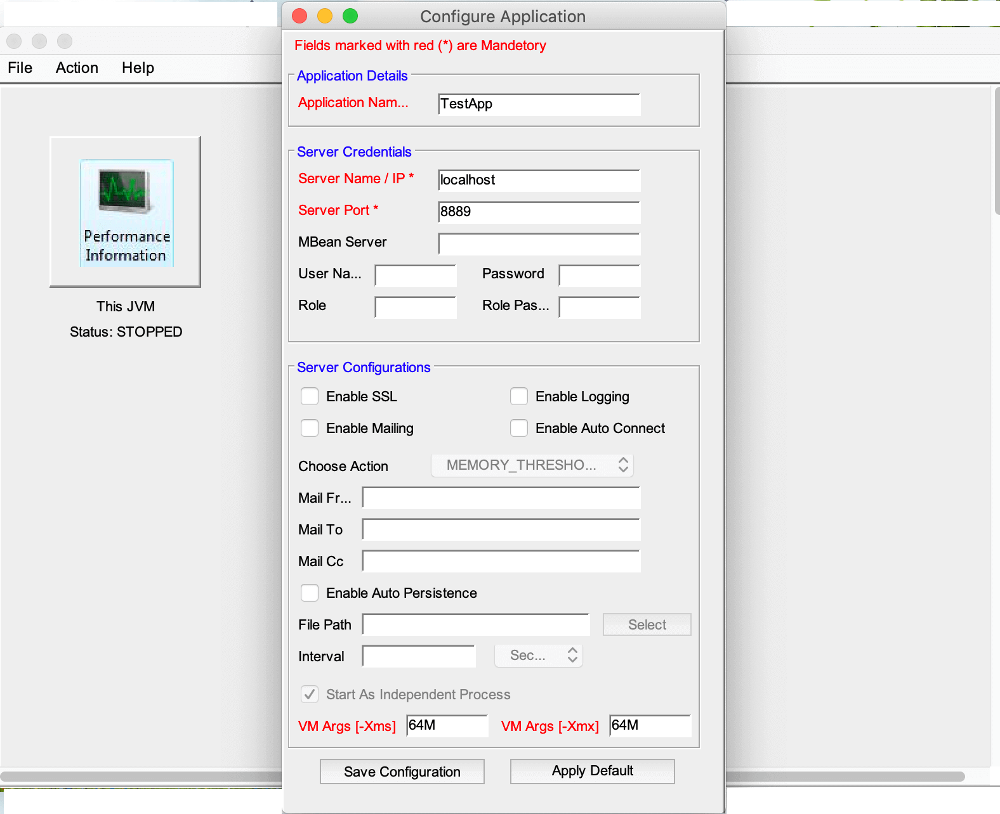
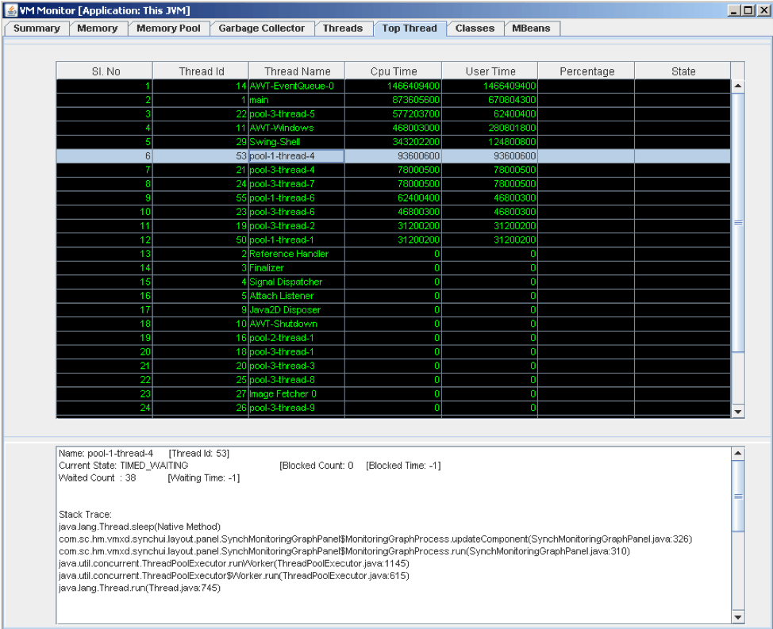

The JVM Monitoring was written way back in **2008** with **jdk 1.5**, when very first time, **Tiger** had introduced the **management beans** APIs. I have been using it for my own purpose. Often it was shared with my friends and colleagues. You will still find the old-school **ant** build technique here. As the world has moved towards automated build management system and maven became more stable (with very few versioning issue), I have introduced **maven** build here, though you will find all the dependent jars present in the **lib** directory itself.

## Summary
This document describes the VM monitoring tool.  It uses the extensive JMX instrumentation of the Java virtual machine to provide information on performance and resource consumption of applications running on the Java platform.
It not only defines the management interfaces for the Java virtual machine, but also provides out-of-the-box remote monitoring and management on the Java platform and of applications that run on it. 
Overall it provides the comprehensive monitoring support of the followings:
* VM Memory
* VM Memory Pool
* VM Garbage Collector
* VM Thread
* VM Class
* VM Platform Managed Beans

VM Monitoring supports all JDK application with version 1.5 and above. However it does not support the monitoring of any JDK application running with a version lower than that.

Monitoring of any application/web server, e.g., Tomcat, JBoss and Weblogic Server, etc is also supported.


## Starting VM Monitoring
VM Monitoring can be used to both local (or self) application as well as remote application. Once it is started with the specified parameters (Host Name and/or Port Name), it connects to the running VM which started with the management agent. To start a **java** application with management agent use the following syntax:

```
java –Dcom.sun.management.jmxremote.port=8999 -Dcom.sun.management.jmxremote.ssl = false -Dcom.sun.management.jmxremote.authenticate=false <other options ...>
```

To start the VM Monitoring, run

```
java –jar deploy/jvm_monitor.jar
```

It opens a dashboard (see below). If you haven't configured any (java) application for monitoring, the initial dashboard will be empty. In case there are applications configured, they will appear (as depicted below). Click on **Action --> Configure New Application**, and a small dialog box will appear. You need to fill up only three text boxes:

1. Application Name - Must be unique
1. Server Name / IP - The host name where this application is running. If running in same host, provide **localhost**
1. Server Port      - JMX port (value of com.sun.management.jmxremote.port system parameter)

There are other options, but you can ignore them for time being. We will discuss them later in details.



Once done, click on **Save Configuration**. You will notice a new ICON appear on the dashboard.

To start the monitoring, either double click on the icon, or right click and choose **Launch Monitoring**.


When VM Monitor successfully establishes the connection, it obtains information from the JVM MBeans in the connected JMX agent, and displays the information in the following tabs: 
* Summary tab. Summary information on the JVM and on monitored values.
* Memory tab. Information on memory use.
* Memory Pool tab. Information on memory pool use.
* Garbage Collector tab. Information on Garbage Collector.
* Threads tab. Information on thread use.
* Top Thread tab: CPU/User time of top threads.
* Classes tab. Information on class loading.
* MBeans tab. Information on all Management Beans.


##	Summary Information Tab
The Summary tab displays some key monitoring information on thread usage, memory consumption, and class loading, plus information on the JVM and operating system.


There are five tabular areas where the information is displayed. At the bottom there are three radio buttons to change the Look and Feel of the current GUI.


##	Memory Information Tab
The Memory tab provides information on memory consumption (for HEAP and NON HEAP)


* The top panel features is described in Appendix A.
* The main chart shows JVM’s Memory Usage versus Time for the selected Memory.
* The details area shows several current Memory Metrics.
  * Init: the amount of memory allocated during startup
  * Used: the amount of memory currently used. Memory used includes the memory occupied by all objects including both reachable and unreachable objects.
  * Committed: the amount of memory guaranteed to be available for use by the JVM. The amount of committed memory may change over time. The Java virtual machine may release memory to the system and committed could be less than the amount of memory initially allocated at startup. Committed will always be greater than or equal to used.
  * Max: the maximum amount of memory that can be used for memory management. Its value may change or be undefined. A memory allocation may fail if the JVM attempts to increase the used memory to be greater than committed memory, even if the amount used is less than or equal to max (for example, when the system is low on virtual memory).
  * Grabage Collectors: Details of Memory Managers.
* The two Bar shows the statistical usage (in %) of both the type of Memories
* The lowermost two charts show the overview of Memory Usage for both the type of Memories.

The graph moves in an interval of **4 seconds** (configurable).


## Memory Pool Information Tab
The Memory Pool tab provides information on memory consumption (for all memory pools)


 

* The top panel features is described in Appendix A.
* The main chart shows JVM’s Memory Usage versus Time for the selected Memory Pool.
* The details area shows several current Memory Pool Metrics.
  * Init: the amount of memory allocated during startup
  * Used: the amount of memory currently used. Memory used includes the memory occupied by all objects including both reachable and unreachable objects.
  * Committed: the amount of memory guaranteed to be available for use by the JVM. The amount of committed memory may change over time. The Java virtual machine may release memory to the system and committed could be less than the amount of memory initially allocated at startup. Committed will always be greater than or equal to used.
  * Max: the maximum amount of memory that can be used for memory management. Its value may change or be undefined. A memory allocation may fail if the JVM attempts to increase the used memory to be greater than committed memory, even if the amount used is less than or equal to max (for example, when the system is low on virtual memory).
  * Grabage Collectors: Details of Memory Managers.
  * Usage Threshold: Each memory pool has a manageable attribute called the usage threshold which has a default value supplied by the Java virtual machine. The default value is platform-dependent. The usage threshold can be set or reset via the Set/Reset buttons, which will appear left side of the bar if the type of memory pool supports the same. If the threshold is set to a positive value, the usage threshold crossing checking is enabled in this memory pool. If the usage threshold is set to zero, usage threshold crossing checking on this memory pool is disabled
  * Collection Usage Threshold: Collection usage threshold is a manageable attribute only applicable to some garbage-collected memory pools. After a Java virtual machine has expended effort in reclaiming memory space by recycling unused objects in a memory pool at garbage collection time, some number of bytes in the memory pools that are garbage collected will still be in use. The collection usage threshold allows a value to be set for this number of bytes such that if the threshold is exceeded
* The two Bar shows the statistical usage (in %) of the selected Memory Pool
* The lowermost two charts show the overview of Memory Usage for all available Memory Pools.

The graph moves in an interval of **4 seconds** (configurable).


## Garbage Collector Information Tab
The Garbage Collector tab provides information on garbage collection of specific memory pools
Garbage collection (GC) is how the JVM frees memory occupied by objects that are no longer referenced. It is common to think of objects that have active references as being "alive" and un-referenced (or unreachable) objects as "dead." Garbage collection is the process of releasing memory used by the dead objects. The algorithms and parameters used by GC can have dramatic effects on performance.
 


* The top panel features is described in Appendix A.
* The main chart shows Garbage Collections versus Time for the selected Garbage Collector.
* The details area shows several current Garbage Collector Metrics.
  * Current Collection: the number of objects garbage collected.
  * Elapsed Time: Time taken.
  * Total Collections: total number of objects garbage collected since startup.
  * Total Elapsed Time: Total time taken.
* The lowermost two charts show the overview of Garbage Collection for all available Garbage Collectors.
The HotSpot VM garbage collector uses generational garbage collection. Generational GC takes advantage of the observation that, in practice, most programs create:
  * many objects that have short lives (for example, iterators and local variables).
  * some objects that have very long lifetimes (for example, high level persistent objects)

So, generational GC divides memory into several generations, and assigns each a memory pool. When a generation uses up its allotted memory, the VM performs a partial garbage collection (also called a minor collection) on that memory pool to reclaim memory used by dead objects. This partial GC is usually much faster than a full GC.
The HotSpot VM defines two generations: the young generation (sometimes called the "nursery") and the old generation. The young generation consists of an "eden space" and two "survivor spaces". The VM initially assigns all objects to the eden space, and most objects die there. When it performs a minor GC, the VM moves any remaining objects from the eden space to one of the survivor spaces. The VM moves objects that live long enough in the survivor spaces to the "tenured" space in the old generation. When the tenured generation fills up, there is a full GC that is often much slower because it involves all live objects. The permanent generation and code cache hold all the reflective data of the virtual machine itself, such as class and method objects.


## Thread Information Tab
The Threads tab provides information on thread use.
 


* The top panel features is described in Appendix A.
* The main chart shows Process CPU usage versus Time for the selected Garbage Collector.
* The details area shows several current Thread Metrics.
  * Total Started: number of thread started since JVM startup.
  * Live Thread: number of thread currently alive.
  * Peak Thread: peak thread count.
  * Deadlocked Thread: Total number deadlocked thread (if any).
* The Threads list in the lower left lists all the active threads (ID:Name).
* If user clicks on the name of a thread in the list, the information (including the thread name, state, CPU Usage and stack trace) will be displayed on the Text Area. 

## Top Threads Tab
The Top Thread tab displays the top cpu consuminng thread. You can select the thread to get the current point of execution.




## Class Information Tab
The Classes tab provides information on class loading.


* The top panel features is described in Appendix A.
* The main chart shows number of class loaded versus time.
* The details area shows several current class loading Metrics.
  * Total Class: number of thread started since JVM startup.
  * Loaded Class: number of thread currently alive.
  * Unloaded Class: peak thread count.
* The lowermost three charts show the overview of class loading.


## Management Beans Information Tab
The MBean tab displays information on all the MBeans registered with the platform MBean server


* The tree on the left shows all the MBeans, organized according to their ObjectNames. The Refresh button is used to refresh the entire MBean tree.
* When you select an MBean in the tree, its attributes, operations, notifications and other information is displayed on the right pane. 
You can set the value of the attributes, if they are writeable. 


## Appendix A

### Selection Panel Feature
The selection panel (top panel) features with conjunction with Memory Pool Tab is described below:


* Select Option: List down all the available Memory Pools. The main panel will display the memory usage of the pool selected from the drop down.
* Duration: Displays the time span during which the memory usage will be displayed. Default span is 1, that means the chart will display the memory usage for last [800 / (40 / 1) * 4] = 80 seconds (approx), [4 = default delay (seconds)]. Selecting span 400 (max) will show the graph for a period of [800 / (40 / 400) * 4] = 32,000 seconds (approx 9 hrs)
The general formula is Time Span = [800 / (40 / d) * s].
Where d = Duration. S = Graph Delay (in seconds).
* Axis Color: Selecting a color will change the X and Y Axis color
* Graph Color: Selecting a color will change the graph color.
* Graph delay:	Specifies the delay (in seconds) between consecutive points.
* Stroke Level: Specifies the stroke level (thickness) of the Graph Line. Drop Down will be disabled if Duration goes beyond 40.
* Dynamic Axis: Selecting this will reduce the Y axis span to get a closer detail of the values.
* Show X: Specify whether to show X Lines.
* Show Y: Specify whether to show Y Lines.
* Fill G:	Selecting this will start filling the graph. Check box will be disabled if Duration goes beyond 40.
* Pause: Clicking on which will pause the main graph
* Resume: Clicking on which will restart the main graph (will plot the intermediate points as well during which the graph was stopped).
* Persist D: Persist the Graph Data to CSV file.

Bubble Data will show the current value of Y with respect to X on Mouse Move on main Graph Panel.


### Example 1: 
Following figure shows the same Graph with Duration 40 and Dynamic Axis on and show Y unchecked.
The Y axis duration is reduced to 16 byte to 1.1875 MB (earlier 0 to 4 MB). Time duration has increased to 16:35:30 to 17:30:10 (earlier 16:53:48 to 16:55:08). The Y lines are not visible.
 


### Example 2: 
Following figure shows the same Graph with Duration 2 and Dynamic Axis on and Fill G checked. Also Axis Color changed to ORANGE.
The time span (X axis) is accordingly adjusted.


### Example 3:  
Following figure shows the same Graph with Duration 100 and Dynamic Axis on and show Y unchecked. Also you can see the bubble data during mouse move.
 


### Example 4: 
Following figure shows the graph for Memory Pool Tenured Gen width Duration 100 and bubble data. Since the Usage Threshold supported for this pool, which is why the Set and Reset button is enabled. On clicking the Set button a pop up will appear where user can specify the Threshold value in order to enable Usage Threshold Monitoring. The threshold value can be any value between 1% to 99%, or in bytes, but should be greater than Initial Memory. Once user provides the value and press ok button, the value will be set and thus enable the usage threshold monitoring. The Usage Threshold Count in Details panel will increment the count whenever memory usage (for pool Tenured gen) will exceed the Threshold Value.


### Example 5: 
Following figure shows the scenario after the Usage threshold is set for the Memory Pool Tenured Gen. you can see the Orange Colored area which says how much percent is the current threshold value with respect to the max value; also the value is displayed on Details Panel. Clicking on Reset button will reset the Usage Threshold (set it to 0) thus disabling Usage Threshold Monitoring. However the same can be done in MBeans Tab as well.


### Example 6: 
Following figure shows the scenario after the Usage threshold is set for the Memory Pool Tenured Gen with Duration 200. On clicking the Persist D Button the pop up will appear and you can select the folder (e.g. H:\test) and csv files will be generated for all the memory pools.


If the Remote/Local JVM is stopped or crashed, VM Monitor will identify it and prompt user with the message “Remote Connection is Broken. Do you want to take a Backup of Your Data”, thus allowing user to save the monitoring details locally in CSV format.


## Appendix B

### How to take Heap Dump
You can take the heap dump of the local or remote JVM by going to the **MBean** tab (as shown below).
Specify the heap file name, e.g., /tmp/pr.hprof and mention **true** for second argument and click onn dumpHeap operation.


Once the heap dump is obtained, you wil see a confirmation box.

## Appendix C

### Comparison with Jconsole/JVisualVM
Feature Not Supported:
1. Does not automatically detect local JVM started with Management Agent. User needs to explicitly specify the port
1. Does not support User Id and Password authentication, the feature will be included in a later version.
1. Does not show unnecessary graph for all Integer attribute in MBeans Tab. Major Graphs have been shifted to individual tab.

Additional Features:
1. Memory and Memory Pool are segregated and showed in different tab for better management. 
1. Only associated Garbage Collector (or Memory Manager) information displayed against individual Memory Pool, thus removing generic Garbage Collector information.
1. Usage Threshold and Collection Usage Threshold information displayed on Memory Pool tab, also user is allowed to change Usage Threshold in order to activate Usage Threshold Monitoring.
1. For individual tab, all other selections’ overviews are displayed at the lower part of the Panel. Which also change in an interval of 4 seconds, (e.g., For Memory Pool tab, apart from the current selection, all other Memory Pool chart is shown at the lower part of the panel which moves in an interval of 4 seconds).
1. Added Garbage Collector Panel in order to view the Garbage Collection chart.
1. Bubble data will be displayed as user moves the mouse over the Main Chart thus showing the exact usage at a particular point of time.
1. Allows user to pause the graph (to take an overview/monitor closely) and resume it.
1. User, at any point of time, can persist the entire data for a particular tab by clicking the Persist D button, which will store all the data to the Hard Disk in CSV file format.
1. If remote connection is broken, system will show error message to the user and allows user to keep a backup of the existing data before terminating the application.
1. With the help of Duration and Graph Delay combo box, User can see data for a maximum duration of 32000 / 4 * 3600 seconds = 333 days (almost 1 year).
1. User can change the Graph/Axis color for better view or can see a filled graph upon selecting appropriate check box.
1. If started in a Windows Environment, the Look And Feel is automatically changed Windows, however user can change the Look And Feel of the UI by choosing a particular skin.
1. For Thread tab, individual thread CPU usage also shown in details area.
1. Dynamic Axis option gives user a more detailed observation of the Usage.
1. For Memory and Memory Pool User can see the Committed Memory Graph along with Normal Memory Usage upon selecting the checkbox Show C.

